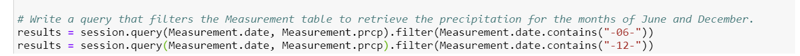
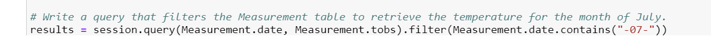

# Surfs_up_Analysis

## Overview of Surfs_Up Analysis
The purpose of this analysis was to calculate the statisstics on temperature data for the months of June and December in Oahu so that we can determine if the surf and ice cream shop business is sustainable year-round.

## Surfs_up Results
Based on the results of the Surfs_up Analysis it appears that:
  - Over the course of 10 years, the month of June has almost 200 more tempertures counted than the month of Decemeber even though December has one more day in the month.
  - The month of December was almost 10 degrees lower than June with a minimum temperature of 56 degrees.
  - However, the month of June was only 2 degrees higher than December with a maximum temperature of 85 degrees. 

## Surfs_Up Summary
Based on the results of the Surfs_up Analysis it appears that although the two months minimum temperature are almost a 10 degree difference, their maximum temperatures are only a 2 degree difference meaning that it has about the same maximum temperature year round.

Two additional queries we could perform to gather more weather data is to filter the date column from the Measurement table to retrieve all the precipitation recordings instead of the temperature in June as well as December. Another query we could perform is to retrieve all of the temperature recordings in another month other than June and December.

  
  
